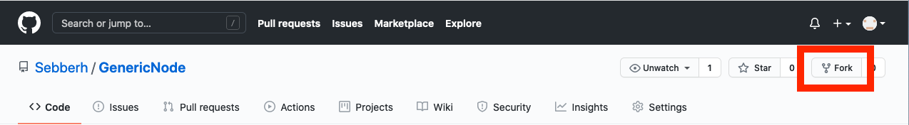
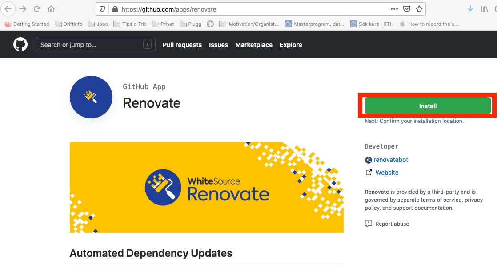
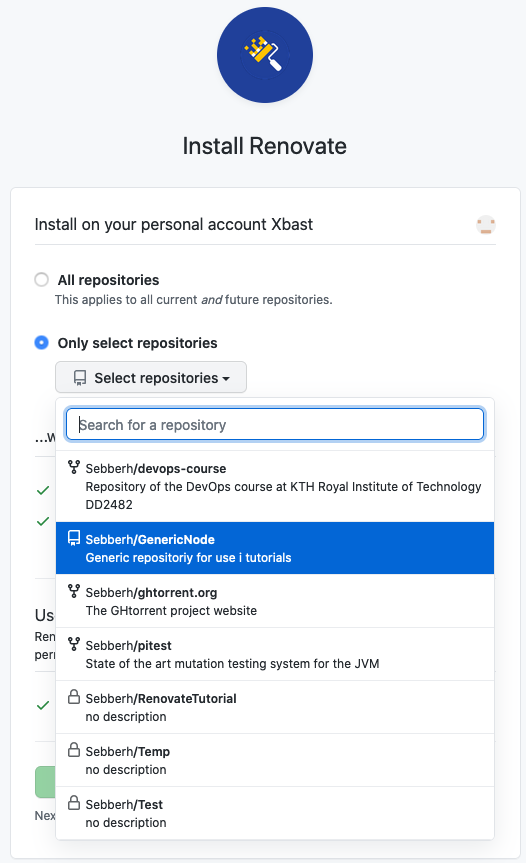
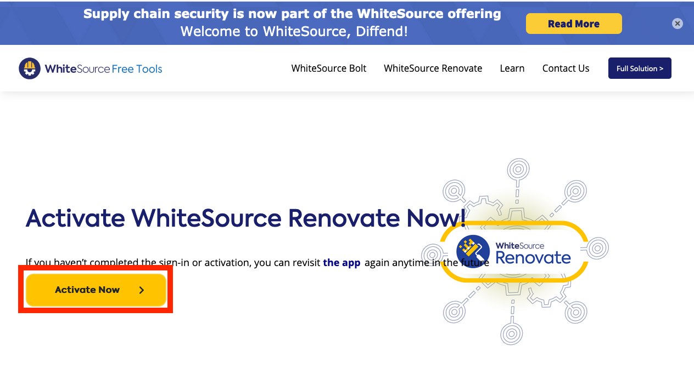
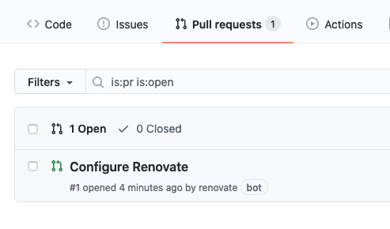
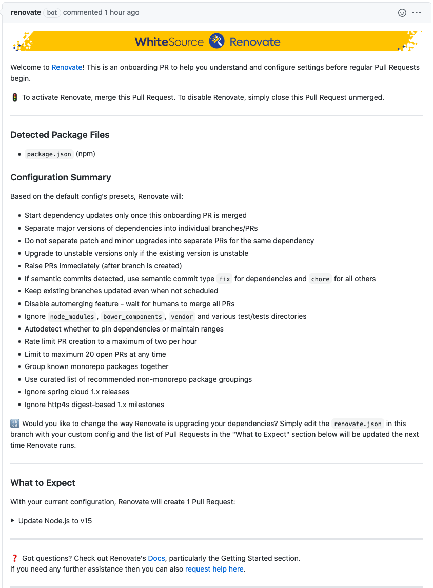
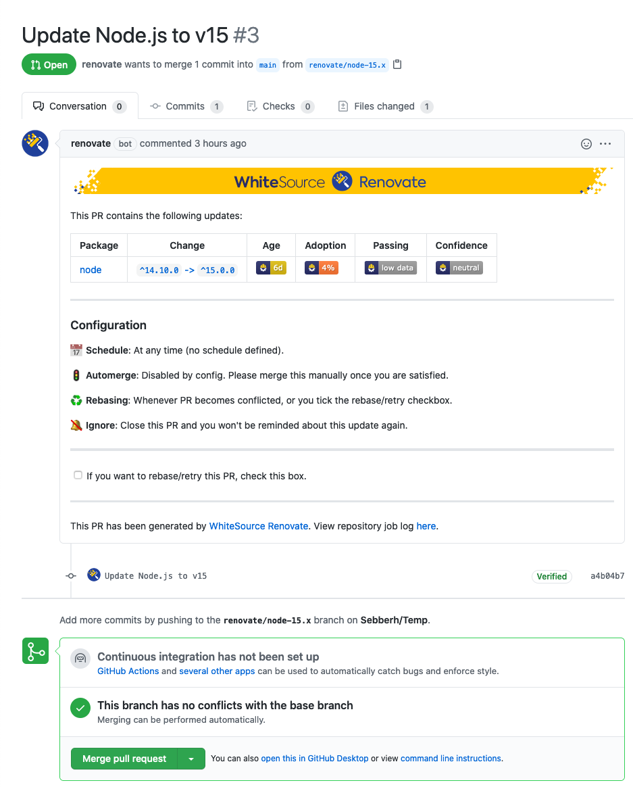

# Executable Renovate-tutorial

## Intro
Renovate is a Denpencay Manger. It's main use is to monitor all dependancies in a project and autoimatically update them according to your chosen preferences. Renovate supports a wealth of languages and is highly customizable.   
This tutorial is only meant to be an introduction, not an exhaustive resource on everthyng thats possible with Renovate.

## Preparation
To complete this tutorial you will only need a Github account and a web-browser.

## Instructions

1. Navigate to <https://github.com/Sebberh/GenericNode>
2. Fork the repository

		
3. Navigate to <https://github.com/apps/renovate> and click the Install button

4. Set repository to either "All repositories" or just select the fork.

5. Click Install
6. Click Activate now and sign in with Github

7. Go to your Fork

8. Go to Pull requests and open the pull request named Configure renovate
 
It should look something like this:

9. Read through the configuration summary and consult the official documentation if there are anything you don't understand(https://docs.renovatebot.com/).

10. Merge the pull request to enable Renovate on your Fork

11. Check the list of pull request again to find a automatically created pull request updating the version of node in the project.

12. Merge he pull request to update.

13. Explore the depth of configuration available at <https://docs.renovatebot.com/configuration-options/> at your own leisure.
