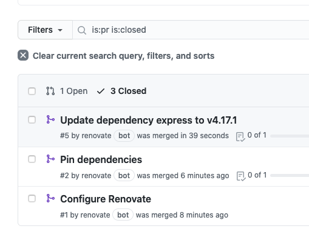

# Executable Renovate-tutorial

## Introduction
Renovate is a dependency manager and its main use is to monitor all dependencies in a project and automatically update them according to your chosen preferences. For instance, Renovate bot will automatically crate pull requests whenever dependencies need updating. Renovate supports a wealth of languages and is highly customizable. There are multiple options on how to set up and use Renovate. It is easily available if you are hosted at Github or Azure DevOps. For platforms such as Bitbucket Cloud, Bitbucket Server, Gitea and GitLab, Renovate can be used by self-hosting it.

This tutorial will provide a breif introduction to the tool and how to set up Renovate bot for a simple node web application hosted at Github.

## Preparation
To complete this tutorial you will only need a Github account and a web-browser.

## Instructions

1. Navigate to <https://github.com/Sebberh/GenericNode>
2. Fork the repository


3. Navigate to <https://github.com/apps/renovate> and click the Install button

4. Set repository to either "All repositories" or just select the fork.

5. Click Install
6. Click Activate now and sign in with Github

7. Go to your Fork

8. Go to Pull requests and open the pull request named Configure renovate
<br/>
It should look something like this:

9. Read through the configuration summary and consult the official documentation. If there are anything you don't understand(https://docs.renovatebot.com/).

10. Merge the pull request to enable Renovate on your Fork

11. Navigate to the project-files and open renovate.json.

12. Overwrite the content with the following:

```
{
  "extends": [
    ":separateMajorReleases",
    ":combinePatchMinorReleases",
    ":ignoreUnstable",
    ":prImmediately",
    ":semanticPrefixFixDepsChoreOthers",
    ":updateNotScheduled",
    ":ignoreModulesAndTests",
    ":autodetectPinVersions",
    ":prHourlyLimitNone",
    ":prConcurrentLimitNone",
    "group:monorepos",
    "group:recommended",
    "helpers:disableTypesNodeMajor",
    "workarounds:all",
    
    ":pinAllExceptPeerDependencies"
  ]
}
```
This configuration is eqvivalent to the defaults with four exeptions:
  - No limit on how many pull requests are created per per hour.
  - No limit on how many pull requests are created concurrantly.
  - Does not disable automerge for the entire repository.
  - Pins all dependacy versions exept peer dependacies.

This is to make ther tutorial run more smoothly. Pull requests will be made before any changes are made to the codebase.

13. Wait for a couple of minutes and the check your pull requests for a request named "Pin dependencies"

14. Open the pull request, it should look something like this:


15. Merge the pull rquest and check that all versions have been pinned.

Next, we'll break the config on purpuse while setting up automerge fo minor updates.

16. Overwrite the renovate.json with the following: 


```
{
  "extends": [
    ":separateMajorReleases",
    ":combinePatchMinorReleases",
    ":ignoreUnstable",
    ":prImmediately",
    ":semanticPrefixFixDepsChoreOthers",
    ":updateNotScheduled",
    ":ignoreModulesAndTests",
    ":autodetectPinVersions",
    ":prHourlyLimitNone",
    ":prConcurrentLimitNone",
    "group:monorepos",
    "group:recommended",
    "helpers:disableTypesNodeMajor",
    "workarounds:all",
    
    ":pinAllExceptPeerDependencies",

    "packageRules": [
    {
      "matchUpdateTypes": ["minor", "patch", "pin", "digest"],
      "requiredStatusChecks": null,
      "automerge": true
    }
  ]
  ]
    
  
}
```

17. Check your Issues and see that Renovate have created an issue stating that the config is broken, including an error-message. It should look something like this:


18. Overwrite the renovate.json again with the following: 


```
{
  "extends": [
    ":separateMajorReleases",
    ":combinePatchMinorReleases",
    ":ignoreUnstable",
    ":prImmediately",
    ":semanticPrefixFixDepsChoreOthers",
    ":updateNotScheduled",
    ":ignoreModulesAndTests",
    ":autodetectPinVersions",
    ":prHourlyLimitNone",
    ":prConcurrentLimitNone",
    "group:monorepos",
    "group:recommended",
    "helpers:disableTypesNodeMajor",
    "workarounds:all",
    ":pinAllExceptPeerDependencies"
  ],
  "packageRules": [
    {
      "matchUpdateTypes": ["minor", "patch", "pin", "digest"],
      "requiredStatusChecks": null,
      "automerge": true
    }
  ]
}

```
19. Check the issue again and see that the bot have closed it automatically. 

20. Open package.json and change the version of express to 4.17.0. The file should look something like this:

```

{
  "dependencies": {
    "express": "4.17.0",
    "node": "16.0.0",
    "react": "17.0.2"
  },
  "name": "nodeexample",
  "version": "1.0.0",
  "description": "Test for tut",
  "main": "app.js",
  "devDependencies": {},
  "scripts": {
    "test": "echo \"Error: no test specified\" && exit 1"
  },
  "author": "Sebastian Fagerlind",
  "license": "ISC"
}
```
21. Wait a couple of minutes and check your closed pull requests and you will see that a pull request have been both created and merged automatically.



22. Explore the depths of configuration available at <https://docs.renovatebot.com/configuration-options/> at your own leisure.
