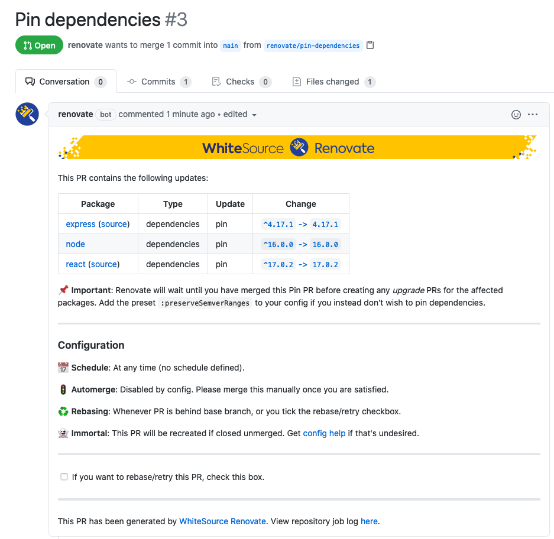
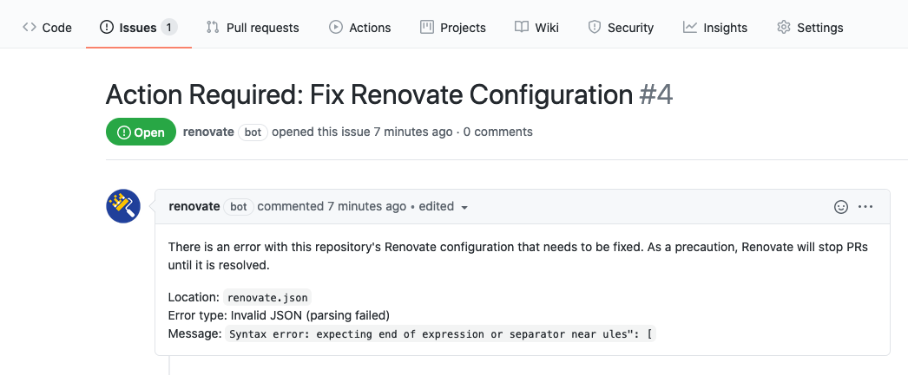

# Executable Renovate-tutorial

## Intro
Renovate is a Dependency Manager. It's main use is to monitor all dependencies in a project and automatically update them according to your chosen preferences. Renovate supports a wealth of languages and is highly customizable.
This tutorial is only meant to be an introduction, not an exhaustive resource on everything that's possible with Renovate.

## Preparation
To complete this tutorial you will only need a Github account and a web-browser.

## Instructions

1. Navigate to <https://github.com/Sebberh/GenericNode>
2. Fork the repository


3. Navigate to <https://github.com/apps/renovate> and click the Install button

4. Set repository to either "All repositories" or just select the fork.

5. Click Install
6. Click Activate now and sign in with Github

7. Go to your Fork

8. Go to Pull requests and open the pull request named Configure renovate
<br/>
It should look something like this:

9. Read through the configuration summary and consult the official documentation. If there are anything you don't understand(https://docs.renovatebot.com/).

10. Merge the pull request to enable Renovate on your Fork

11. Check the list of pull request again to find an automatically created pull request updating the version of node in the project.

12. Merge the pull request to update.

13. Navigate to the project-files and open renovate.json.

14. Overwrite the content with the following:

```
{
  "extends": [
    "config:base",
    ":pinAllExceptPeerDependencies"
  ]
}
```

This will configure rennovate to pin all dependacy versions exept peer dependacies. It will create a pull request before any change is made to the codebase.

15. Wait for a couple of minutes and the check your pull requests for a request named "Pin dependencies"

16. Open the pull request, it should look something like this:


17. Merge the pull rquest and check that all versions have been pinned.

Next, we'll break the config on purpuse by trying to set up automerge fo minor updates.

18. Overwrite the renovate.json with the following: 


```
{
  "extends": [
    "config:base",
    ":pinAllExceptPeerDependencies",
    "packageRules": [
    {
      "matchUpdateTypes": ["minor", "patch", "pin", "digest"],
      "requiredStatusChecks": null,
      "automerge": true
    }
  ]
  ]
  
}
```

19. Check your Issues and see that Renovate have created an issue stating that the config is broken, including an error-message. It should look something like this:



18. Overwrite the renovate.json again with the following: 


```
{
  "extends": [
    ":separateMajorReleases",
    ":combinePatchMinorReleases",
    ":ignoreUnstable",
    ":prImmediately",
    ":semanticPrefixFixDepsChoreOthers",
    ":updateNotScheduled",
    ":ignoreModulesAndTests",
    ":autodetectPinVersions",
    ":prHourlyLimit2",
    ":prConcurrentLimit20",
    "group:monorepos",
    "group:recommended",
    "helpers:disableTypesNodeMajor",
    "workarounds:all",
    ":pinAllExceptPeerDependencies"
  ],
  "packageRules": [
    {
      "matchUpdateTypes": ["minor", "patch", "pin", "digest"],
      "requiredStatusChecks": null,
      "automerge": true
    }
  ]
}

```
19. Check the issue again and see that the bot have closed it automatically. 

20. The configuration can be found in  renovate.json, explore the depths of configuration available at <https://docs.renovatebot.com/configuration-options/> at your own leisure.
